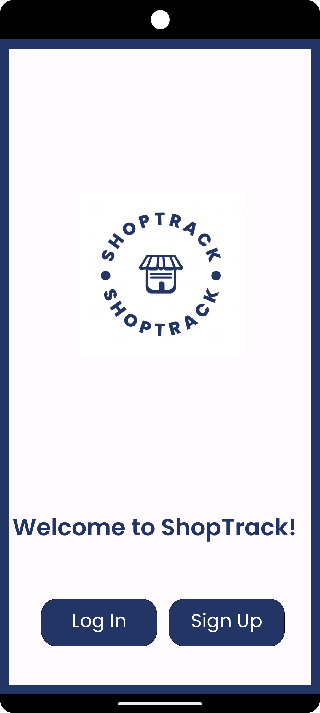
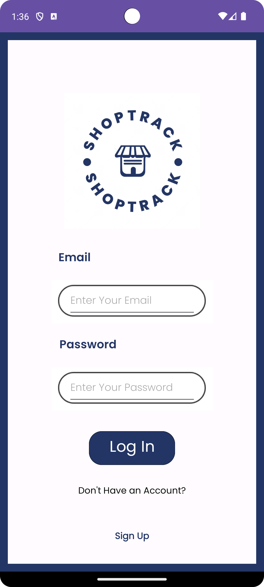
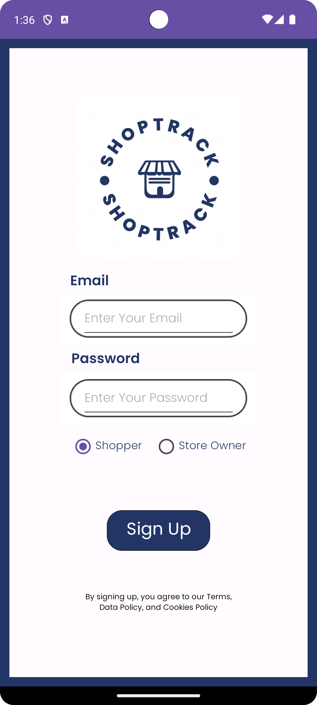
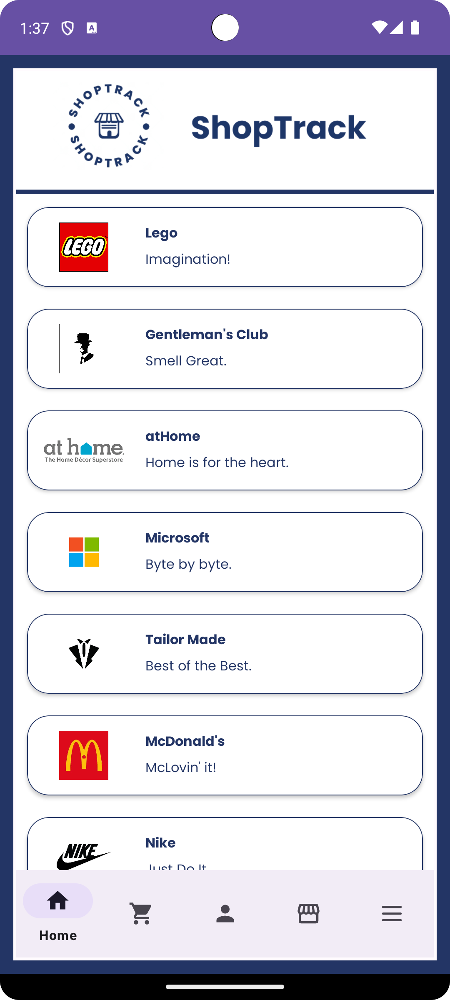
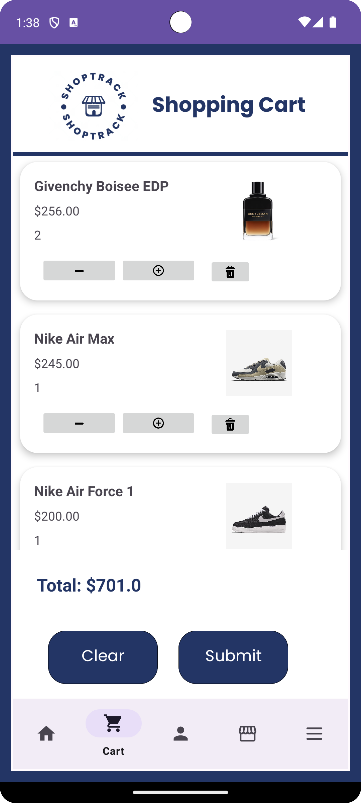
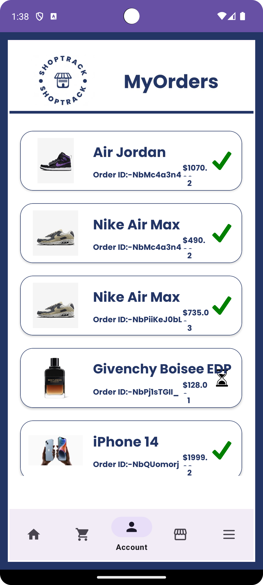
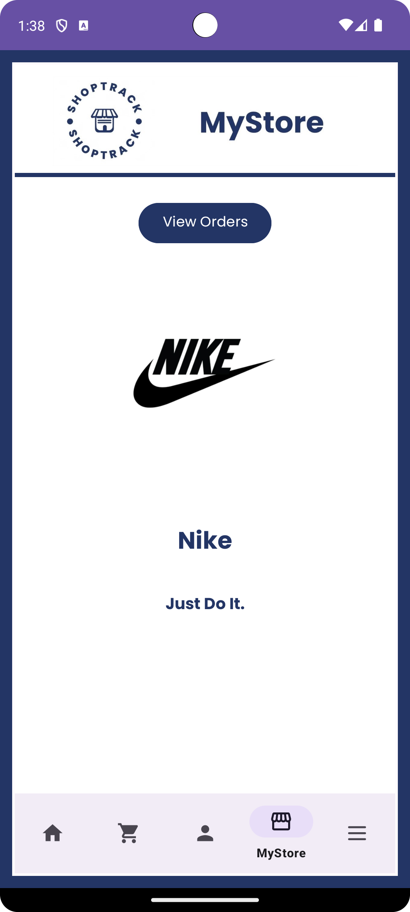
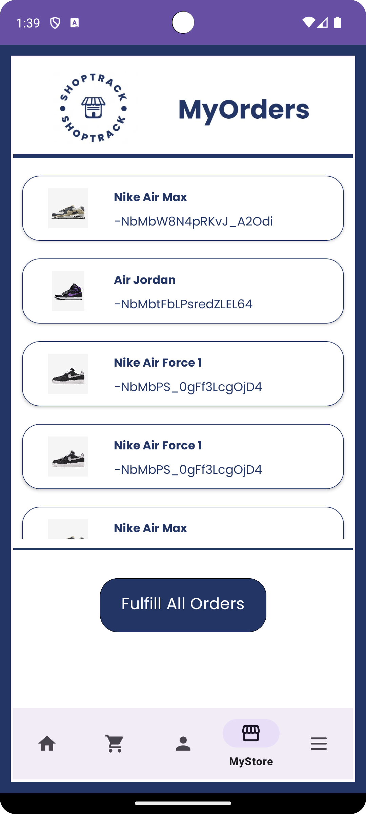
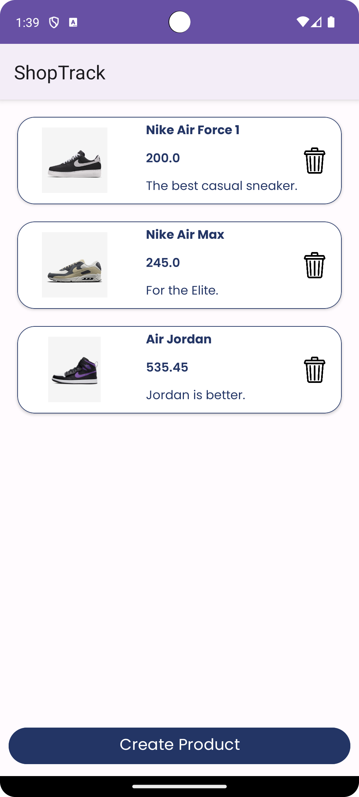

# ShopTrack: Your Virtual Mall Experience

Prototype E-Commerce App

 

## Table of Contents
- [Inspiration](#inspiration)
- [Goal](#goal)
- [The Approach](#the-approach)
- [Features](#features)
  - [Store Owner Features](#store-owner-features)
  - [Shopper Features](#shopper-features)
- [Development Process](#development-process)
  - [Scrum Process](#scrum-process)
  - [Sprints and Milestones](#sprints-and-milestones)
- [Screenshots](#screenshots)
- [Future Enhancements](#future-enhancements)
  
 

## Inspiration
In the wake of the post-COVID era, online shopping has become more than just a convenience, it's an essential part of our daily lives. Malls, being the epicentre of shopping experiences, have been slightly disconnected from this trend. To bridge this gap, Javan Codewell, a local mall manager, envisioned an application that encapsulates the mall experience and brings it to the comfort of a shopper's home. Hence, "ShopTrack" was born.

 

## Goal
Our main goal with ShopTrack is to provide a platform where store owners can showcase their products and shoppers can explore and order from multiple stores seamlessly.

 

## The Approach
Recognizing the significance of online presence for malls, we dived into creating a user-friendly and efficient application that meets the needs of both store owners and shoppers. The UX/UI was designed to be intuitive, and the backend was developed to handle diverse store inventories and customer orders.

 

## Features
### Store Owner Features:
- Account Creation and Management: Store owners can create and log into a unique account to manage their store's data securely.
- Product Showcase: A dedicated space on the app to display all products, their prices, brands, and other essential details.
- Order Management: Store owners can view all incoming orders and track their progress.
- Order Completion: Mark orders as complete, notifying shoppers that their items are ready for pickup.

### Shopper Features:
- Personal Account: Shoppers can sign up and log into their accounts to save data and track orders.
- Store Exploration: Access and browse through all the stores available on the app.
- Order Placement: Shoppers can create orders without visiting the mall physically.
- Item Preview: Visual confirmation of items before placing them in the cart.
- Order Tracking: Shoppers can review previous orders and check their status.
- 

## Development Process
### Scrum Process:
- Standup Meetings: Regular meetings were conducted to keep the team aligned with project goals and to resolve any hurdles faced during the development process.
- Jira Integration: All user stories and development tasks were tracked using Jira, ensuring timely completion and comprehensive documentation.
  
### Sprints and Milestones:
- Sprint 1: Initial design and mock-ups, database schema creation, setting up the development environment.
- Sprint 2: Back-end development, integrating database with the app, creating the store-owner interface.
- Sprint 3: Developing the shopper interface, testing, and debugging.

 

## Design
Initially, Figma was used to design the UI of the app for the Login/SignUp, Home, Cart, Orders, Store, and Settings pages.

<h2>Welcome</h2>

 
 

<h2>Main Functionality Pages</h2>

 
 

<h2>Store Owner Pages</h2>

 
 

## Demo
Below is an example of creating a new store as a vendor, ordering from that store as a user and fulfilling the order from the vendor side. Users are able to order from multiple stores without placing order tracking functionality at risk.  
 

https://github.com/kutluk-ken/ShopTrack/assets/56012015/b4a2a66e-5650-4940-b3ff-b94b99e55667

 

  

## Future Enhancements
As the future unfolds, we plan to integrate more features into ShopTrack:  
 
- Integration with delivery services for home delivery.
- Loyalty points and rewards for frequent shoppers.
- AR integration for virtual try-on experiences.
- Real-time inventory management for store owners.
 

<h1>Technologies Used</h1>

